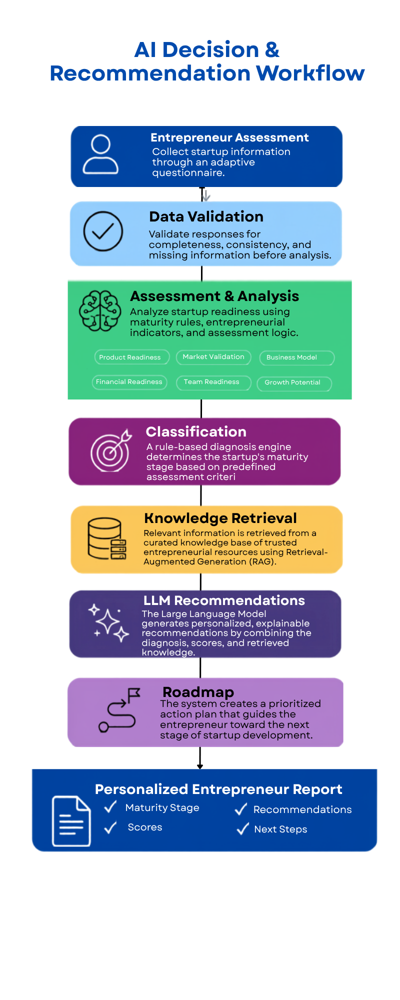

# Startup CompassIQ

### Intelligent Entrepreneurial Orientation Engine for Tunisia

> Empowering entrepreneurs through AI-driven startup diagnosis, explainable evaluation, and personalized entrepreneurial guidance.

---

# 📚 Table of Contents

- Overview
- Problem Statement
- Solution
- Key Features
- AI System Architecture
- Startup Maturity Model
- Explainable Scoring Methodology
- System Diagrams
- Tech Stack
- Repository Structure
- Project Status
- Roadmap
- Team
- License
- Vision

---

# 📌 Overview

Startup Compass AI is an AI-powered entrepreneurial orientation system designed for the **AI for Entrepreneurship Hackathon**.

It helps entrepreneurs understand their startup maturity stage, evaluate their business readiness, detect key gaps, and receive personalized recommendations based on structured reasoning and trusted entrepreneurial knowledge.

Unlike generic AI chatbots, this system is a **decision-support engine** combining:

- Rule-based diagnosis
- Explainable scoring
- Retrieval-Augmented Generation (RAG)
- Large Language Models (LLMs)

---

# 🎯 Problem Statement

Entrepreneurs in early-stage startup development face several challenges:

- Difficulty identifying their true startup maturity stage
- Lack of structured feedback on their project readiness
- Fragmented access to entrepreneurship ecosystem resources
- Over-reliance on generic advice from AI tools
- No clear guidance on next actionable steps

Existing solutions provide either:
- information (Google, documents), or
- generic answers (chatbots)

but NOT structured entrepreneurial diagnosis.

---

# 💡 Solution

Startup Compass AI provides a structured entrepreneurial guidance system that:

- Collects startup data through an adaptive questionnaire
- Identifies maturity stage using a rule-based engine
- Evaluates entrepreneurial dimensions using explainable scoring
- Detects gaps in business development
- Retrieves relevant ecosystem knowledge (RAG)
- Generates personalized recommendations using AI
- Produces a complete entrepreneurial roadmap

---

# ⚙️ Key Features

## 1. Adaptive Diagnostic Engine
Dynamically adjusts questions based on user responses to collect relevant startup information.

## 2. Startup Maturity Classification
Automatically classifies startups into 6 stages:
Idea → Market Validation → Structuration → Fundraising → Launch → Growth

## 3. Explainable Scoring System
Evaluates startups across 5 dimensions:
- Market Potential
- Commercial Viability
- Innovation
- Scalability
- Sustainability

## 4. Gap Detection Engine
Identifies missing elements such as:
- No customer validation
- Weak business model
- Lack of revenue
- No scalability plan

## 5. AI Recommendation System
Combines structured data + knowledge base + LLM reasoning to generate actionable guidance.

---

# 🧠 AI System Architecture

Startup Compass AI is built using a hybrid architecture:

- Rule-based decision engine (for classification)
- Explainable scoring system (for evaluation)
- Retrieval-Augmented Generation (RAG)
- Large Language Model (for explanation & recommendations)

---

# 📊 Startup Maturity Model

| Stage | Description |
|------|-------------|
| 💡 Idea | Initial concept, no validation |
| 🧪 Market Validation | Prototype and early testing |
| 🏗 Structuration | Business model being developed |
| 💰 Fundraising | Seeking investment readiness |
| 🚀 Launch | Active market entry |
| 📈 Growth | Scaling operations |

---

# 📈 Explainable Scoring Methodology

Each startup is evaluated across five dimensions:

- Market Score
- Commercial Score
- Innovation Score
- Scalability Score
- Green Impact Score

### Principles:
- Each score is based on weighted criteria
- Scores are fully explainable
- Every output includes justification and improvement suggestions
- Gating rules ensure realistic evaluation (not just averages)

📄 Full document:
👉 [Scoring Methodology PDF](docs/scoring/scoring_methodology.pdf)

---

# 🧩 System Diagrams

All system diagrams are available below:

  

📄 [Download PDF](docs/diagrams/system_architecture.pdf)

  

📄 [Download PDF](docs/diagrams/ai_workflow.pdf)

  

📄 [Download PDF](docs/diagrams/user_journey.pdf)

---

# 🧰 Tech Stack

| Layer | Technology |
|------|-----------|
| Frontend | Streamlit |
| Backend | Python |
| AI Models | LLM (OpenAI / Gemini) |
| RAG | LangChain + ChromaDB |
| Data | JSON / Structured datasets |
| Version Control | Git & GitHub |

