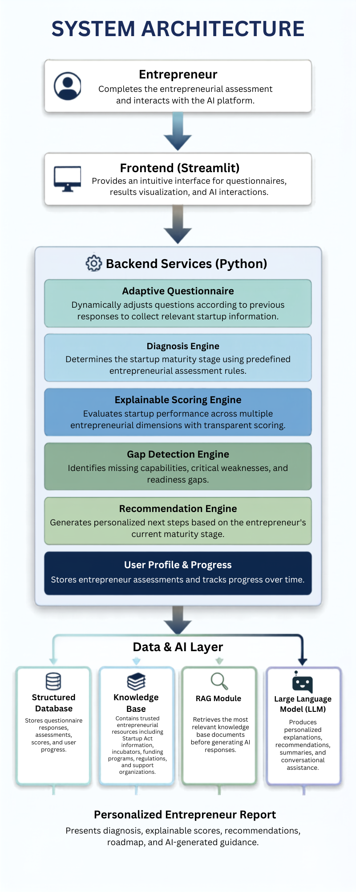
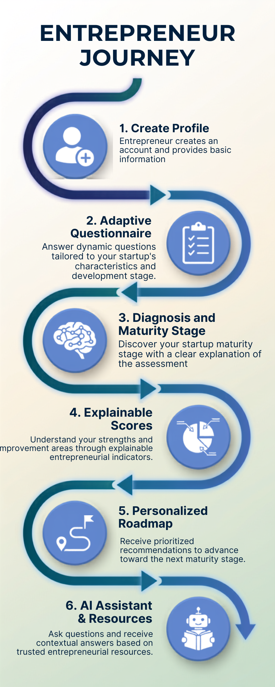

<div align="center">

<h1> CompassIQ</h1>

<p><strong>Intelligent Entrepreneurial Orientation Engine for Tunisia</strong></p>


> Empowering Tunisian entrepreneurs through AI-driven startup diagnosis, explainable scoring, and personalized guidance.

</div>

---

## Table of Contents

- [Overview](#-overview)
- [Problem Statement](#-problem-statement)
- [Solution](#-solution)
- [Key Features](#-key-features)
- [Startup Maturity Model](#-startup-maturity-model)
- [Explainable Scoring Methodology](#-explainable-scoring-methodology)
- [System Diagrams](#-system-diagrams)
- [Documentation & Deliverables](#-documentation--deliverables)
- [Tech Stack](#-tech-stack)
- [Repository Structure](#-repository-structure)
- [Getting Started](#-getting-started)

---

## Overview

CompassIQ is an AI-powered entrepreneurial orientation platform built for the **AINS Hackathon 2026**.

It helps Tunisian entrepreneurs understand their startup maturity stage, evaluate business readiness, detect key gaps, and receive personalized recommendations — all through structured reasoning grounded in real entrepreneurial knowledge.

Unlike generic AI chatbots, CompassIQ is a **decision-support engine** combining:

- Rule-based maturity classification
- Weighted explainable scoring across 5 dimensions
- Gating rules for realistic (not inflated) evaluation
- Groq-powered LLM for personalized recommendations
- Bilingual interface (French / Arabic)

---

## Problem Statement

Early-stage entrepreneurs in Tunisia face real structural challenges:

- Difficulty identifying their true startup maturity stage
- No structured feedback on project readiness
- Fragmented access to ecosystem resources
- Over-reliance on generic AI tools that lack domain grounding
- No clear guidance on next actionable steps

Existing tools offer either raw information (search engines, documents) or generic answers (chatbots) — **not structured entrepreneurial diagnosis.**

---

## Solution

CompassIQ provides a guided, structured entrepreneurial assessment that:

1. Collects startup data through an **adaptive questionnaire** (JSON-driven)
2. Classifies the startup into one of **6 maturity stages** using a rule-based engine
3. Evaluates across **5 scored dimensions** with full explainability
4. Detects specific **gaps** blocking progression
5. Generates **personalized roadmaps** via Groq LLM
6. Delivers everything in a **bilingual (FR/AR)** responsive interface

---

## Key Features

### 1. Adaptive Diagnostic Engine
Dynamically adjusts questions based on user responses. Question flow, branching logic, and display rules are all defined in `questions.json` — no hardcoding required.

### 2. Startup Maturity Classification
Classifies startups into 6 stages using `maturity_rules.json`:

> Ideation → Market Validation → Structuration → Fundraising → Launch Planning → Growth

### 3. Explainable Scoring System
Evaluates startups across 5 weighted dimensions. Every score includes:
- Sub-criteria breakdown
- Gating rule status (and whether the gate was actually the limiting factor)
- Primary gap identification
- Bilingual justification text

### 4. Gap Detection Engine
Surfaces missing elements such as:
- Insufficient customer validation (< 5 interviews)
- Undefined revenue model
- Absence of prototype
- No growth or scalability plan
- Missing environmental assessment for high-impact sectors

### 5. AI Recommendation System (Groq)
Combines structured scoring data + knowledge base context + Groq LLM to produce actionable, stage-aware roadmaps — grounded in Tunisian ecosystem realities.

### 6. Bilingual Interface (FR / AR)
Full French and Arabic support across all UI text, scoring explanations, recommendations, and error messages. All stored text references i18n keys — no raw strings in data files.

---

## Startup Maturity Model

| Stage | Description |
|---|---|
| Ideation | Initial concept, no external validation |
| Market Validation | Early interviews, prototype testing |
| Structuration | Business model being formalized |
| Fundraising | Investment readiness preparation |
| Launch Planning | Active market entry underway |
| Growth | Scaling operations and channels |

---

## Explainable Scoring Methodology

Each startup is scored across five dimensions with the following weights:

| Dimension | Weight | Gating Rule |
|---|---|---|
| Market | 25% | G1 — < 5 customer interviews → cap 50 |
| Commercial Offer | 20% | G2 — revenue = 0 AND no paying customers → cap 50 |
| Innovation | 20% | G3 — no prototype → cap 60 |
| Scalability | 20% | G4 — no growth plan → cap 60 |
| Green Impact | 15% | G5 — high-impact sector + no env. assessment → cap 40 |

**Key design principle:** A gating rule only affects the explanation text when it is *actually* the limiting factor (i.e., `raw_score > cap_value`). If the raw score is already below the cap, the explanation correctly attributes the low score to sub-criteria performance — not the gate.

📄 Full methodology: [scoring_methodology.pdf](docs/scoring/scoring_methodology.pdf)

---

## System Diagrams

<p align="center">
  
</p>

📄 [Download PDF](docs/diagrams/compassiq_system_architecture)

<p align="center">
  
</p>

📄 [Download PDF](docs/diagrams/ai_workflow.pdf)

<p align="center">
  
</p>

📄 [Download PDF](docs/diagrams/user_journey.pdf)

---

## Documentation & Deliverables

All project documents are stored under `docs/`. Replace the placeholder paths below with your actual filenames once uploaded.

### 🎤 Presentation & Pitch

| Document | Description | Link |
|---|---|---|
| Final Presentation | Slides used for the AINS Hackathon 2026 final phase | [compassiq_final_presentation.pdf](docs/presentation/compassiq_final_presentation.pdf) |
| Pitch Deck | Investor-facing pitch deck summarizing the product vision | [compassiq_pitch_deck.pdf](docs/presentation/compassiq_pitch_deck.pdf) |

### 🧠 Explainability & Methodology

| Document | Description | Link |
|---|---|---|
| Scoring Methodology | Full breakdown of the 5-dimension weighted scoring model and gating rules | [scoring_methodology.pdf](docs/scoring/scoring_methodology.pdf) |
| Explainability Layers | Detailed documentation of how score justifications are generated per dimension | [explainability_layers.pdf](docs/scoring/explainability_layers.pdf) |

### 📚 Knowledge Base

| Document | Description | Link |
|---|---|---|
| CompassIQ Knowledge Base | Domain knowledge used to ground LLM recommendations in Tunisian ecosystem context | [CompassIQ_knowledge_base_v2.pdf](docs/knowledge_base/CompassIQ_knowledge_base_v2.pdf) |

### 📊 Evaluation

| Document | Description | Link |
|---|---|---|
| Evaluation Report | Testing results, scoring validation, and model performance analysis | [evaluation_report.pdf](docs/evaluation/evaluation_report.pdf) |

> **Note:** If any document is not yet finalized, replace its link with `_coming soon_` or remove the row until the file is ready.

---

## Tech Stack

| Layer | Technology |
|---|---|
| Frontend | React (TSX) + HTML + CSS |
| Build Tool | Vite |
| Language | TypeScript |
| Backend | Node.js (`server.ts`) |
| AI / LLM | Groq API |
| Knowledge Base | JSON (CompassIQ_knowledge_base_v2.json) |
| Data Layer | JSON (questions, rules, profiles, roadmap explanations) |
| i18n | Custom key-reference system (FR / AR) |
| Storage | File-based (`backend/storage/users/`) |
| Version Control | Git & GitHub |

---

## Repository Structure

```
compassiq/
├── backend/
│   └── storage/
│       └── users/
│           ├── profiles/
│           ├── CompassIQ_knowledge_base_v2.json
│           ├── maturity_rules.json
│           ├── profile_template.json
│           ├── startup_projects.json
│           └── users.json
├── docs/
│   ├── diagrams/
│   ├── evaluation/
│   │   └── evaluation_report.pdf
│   ├── knowledge_base/
│   │   └── CompassIQ_knowledge_base_v2.pdf
│   ├── presentation/
│   │   ├── compassiq_final_presentation.pdf
│   │   └── compassiq_pitch_deck.pdf
│   └── scoring/
│       ├── explainability_layers.pdf
│       └── scoring_methodology.pdf
├── public/
├── reports/
├── src/
│   ├── backend/
│   │   ├── controllers/
│   │   │   ├── chatControllers.ts
│   │   │   └── roadmapController.ts
│   │   ├── routes/
│   │   │   └── chat.routes.ts
│   │   └── services/
│   ├── components/
│   │   ├── DashboardView.tsx
│   │   ├── ErrorBoundary.tsx
│   │   ├── IntakeForm.tsx
│   │   ├── LanguageSwitcher.tsx
│   │   ├── Logo.tsx
│   │   ├── ParcoursEvolution.tsx
│   │   └── StepNavLayout.tsx
│   ├── data/
│   │   ├── CompassIQ_knowledge_base_v2.json
│   │   ├── maturity_rules.json
│   │   ├── project_profile.json
│   │   ├── roadmap_explanations.json
│   │   └── score_explanations.json
│   ├── engine/
│   │   ├── diagnosisEngine.ts
│   │   ├── maturityEngine.ts
│   │   └── scoringEngine.ts
│   ├── hooks/
│   ├── App.tsx
│   ├── localization.ts
│   ├── main.tsx
│   ├── metadata.json
│   └── types.ts
├── index.html
├── project_profile.json
├── questions.json
├── server.ts
├── tsconfig.json
├── vite.config.ts
└── package.json
```

---

## Getting Started

**Prerequisites:** Node.js 18+

```bash
# 1. Clone the repository
git clone https://github.com/your-username/compassiq.git
cd compassiq

# 2. Install dependencies
npm install

# 3. Set your Groq API key
echo "GROQ_API_KEY=your_key_here" > .env.local

# 4. Start the development server
npm run dev
```

---

<div align="center"></div>

Built for the **AINS Hackathon 2026** · Tunisia

</div>

